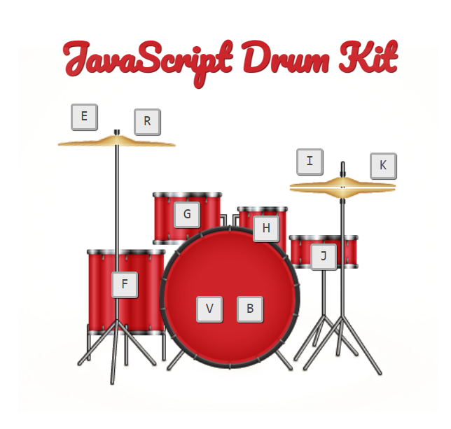

# JavaScript Drum Kit

## Demo

Try the live demo: [JavaScript Drum Kit](https://andrejilic05.github.io/JavaScript-Drums/)

**JavaScript Drum Kit** is an interactive and fun web application that allows users to play a virtual drum kit using their keyboard. Built with HTML, CSS, and JavaScript, this project provides a responsive and engaging drumming experience.

## Project Overview

This application transforms your keyboard into a drum kit, with each key corresponding to a different drum sound. When you press a key, the associated drum sound is played, and the drum element on the screen animates, providing a realistic drumming experience.

## Features

- **Key Mapping:** Each key on the keyboard is mapped to a different drum sound.
- **Realistic Drum Sounds:** High-quality sound effects for each drum.
- **Interactive Animations:** Visual feedback and animations for key presses.
- **Responsive Design:** Adjusts to different screen sizes.

## Technologies Used

- **HTML:** For the structure and content of the application.
- **CSS:** For styling the application, including layout, colors, and animations.
- **JavaScript:** For dynamic functionality, such as playing sounds and handling key events.

## Key Mappings

- `E` - Crash
- `R` - Ride
- `F` - Floor Tom
- `G` - Mid Tom
- `H` - High Tom
- `V`, `B` - Kick
- `J` - Snare
- `I` - Hi-Hat Open
- `K` - Hi-Hat Closed

## 📧 Contact
For any questions or feedback, feel free to reach out:

- Email: ilicandrej2005@gmail.com
- GitHub: AndrejIlic05
